# Отчет по лабораторной работе 1
### Задание 1
* Прагматика - что нужно получить.
* Семантика - как будет работать.
* Синтаксиси - как это написать.
* Исполняемый файл (исполняемый код) — файл, содержащий программу в виде набора элементарных инструкций, которая после загрузки в память может быть выполнена на определенном физическом устройстве (процессоре) под управлением опредленной операционной системы.
* Ассемблер — язык программирования низкого уровня, в котором каждая инструкция физического устройства представлена в текстовом виде.
* Язык программирования высокого уровня - язык абстрогированный от элементарных команд процессора, позволяющий записывать программы в виде более абстрактных понятий (функции, алгоритмы, классы).
* Исходный код - программа написанная на языке высокого уровня.
* Виртуальная машина - средство описания семантики языка программирования.
* Транслятор - техническое средство, осущетвляющее перевод тукста с одного языка на другой.
* Компилятор - транслятор, переводящий программу в машинный код для последующего исполнения (C++).
* Интерпретатор - транслятор, читающий и исполняющий программу по одной команде (Lisp).
* Псевдо компилятор - транслятор, переводящий программу в промежуточное представление (байт-код), который состоит из набора инструкций близких по смыслу к машинному коду.
* Компилирующий интерпретатор - транслятор переводящий текст программы во внутреннем представление непосредственно после запуска. В процессе работы программа инетрпертируется уже в этом представлении (Python).
* REPL-интерпретатор - программное средство, работающее в цикла чтения-вычисления-печати  (Read-Eval-Print Loop).
* Единица трансляции - минимальный фрагмент программы, который может быть транслирован независимо от остального кода.
* Предобработка - выполнение замен в тексте программ по заданным правилам.
* Синтактический анализ и генерация кода - проварка синтаксиса и генерация объектного кода или внутреннего представления программы.
* Сборка (связывание) - Объединение отдельных модулей (едениц трансляции) и внешних библиотек в испольняемую программу.
* Загрузка - загрузка программы в память для последущего исполнения.
* Препроцессинг (предобработка) - начальный этап трансляции программы.
### Задание 2
* cd - перемещение по папкам.
* tab - смена окна.
* mkdir - создание новой папки.
* shift + f4 - создание файла.
* f4 - редактирование файла.
* f5 - копирование файла.
* f8 - удаление файла.
### Задание 3
Трансляция и запуск программы.
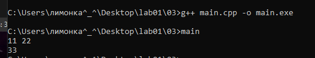
### Задание 4
Сборка всех файлов с последующим удалением hello.o.
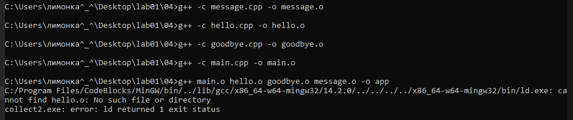
Повторная сборка файла hello.o и запуск программы.
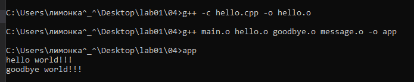
### Задание 5
Сборка всех файлов с последующим удалением Hello.java.
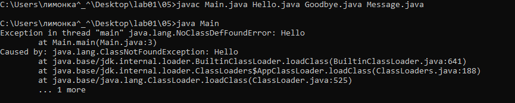
Запуск программы после возвращения Hello.java в папку 05.
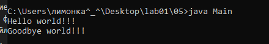
### Задание 6
Попытка запуска программы после удаление hello.py.
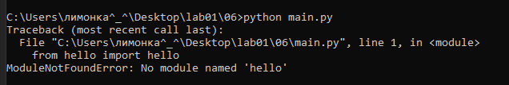
Запуск программы.
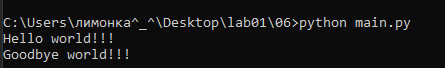
### Задание 7
Сборка через make и проверка на работоспособность без изменения файлов.
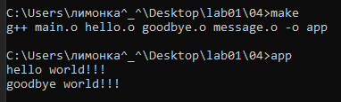
Попытка сборка через make после изменения файла message.h.
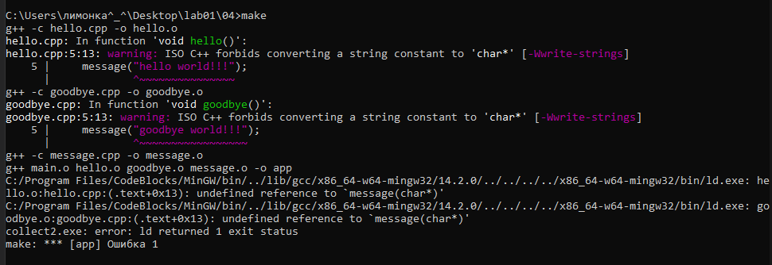
Попытка сборка через make после удаления файла goodbye.cpp.
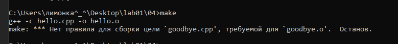
Выполняются только новые команды, то есть если файл уже есть и при запуске команд makefile не поменяется, то команда не выполняется, как пример сборка через make после добавления комментария в файл main.cpp при сохранении всех остальных.
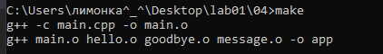
### Задание 8
### Задание 9
При оптимизации 0, команды переведены на машинный код, используется явный цикл.
При оптимизации 1, команды переведены на машинный код, цикл остаётся, но становиться более оптимизированным.
При оптимизации 2, команды изменены на машинный код, цикл отсутствует, ответ находиться умножением x на 123.