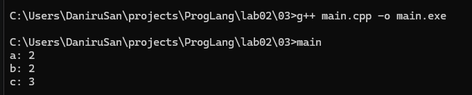
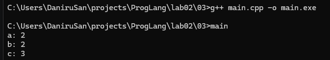
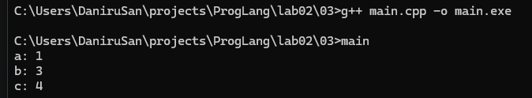

# Лабароторная работа 2
### Задание 1
C++: int, auto, float, for, void.\
Java: int, while, do, for, float.\
Python: for, in, 
### Задание 2
C++:\
int\
main\
(\
)\
{\
int\
a\
=\
1\
,\
b\
=\
2\
;\
int\
c\
=\
a\
++\
b\
;\
return\
0\
;\
}

Python:\
a\
=\
1\
b\
=\
2\
c\
=\
a\
+\
+\
b

В C++ есть токен "++", он увеличивает переменную a на 1, а после идёт переменная b без всего, из-за этого возникает ошибка.

В Python токена "++" нет, но есть токен одноместный токен "+", благодаря этому выражение превращается в обычное сложение, где один из токенов "+" просто вернёт одну из переменных, а второй сложит две переменных.
### Задание 3
Трансляция и запуск программы после добавления в неё вывода всех трёх переменных без добавления пробелов.
\
Трансляция и запуск программы после изменения переменной c на "int c=a++ +b".
\
Трансляция и запуск программы после изменения переменной c на "int c=a+ ++b".
\
Как можно видеть из этих скриншотов место пробела меняет разбиение строки "+++" на два разных набора токенов: "++", "+" и "+", "++".\
Разбивать на токены я буду исходную программу (без добавления вывода).\
int\
main\
(\
)\
{\
int\
a\
=\
1\
,\
b\
=\
2\
;\
int\
c\
=\
a\
++\
+\
b\
;\
return\
0\
;\
}
### Задание 4
Круглые скобочки после имени - оператор вызова функции.\
Круглые скобочки в другом случае - пунктуатор.\
Квадратные скобочки для индексации - оператор.\
Квадратные скобочки в другом случае - пунктуатор.
### Задание 5
### Задание 6
### Задание 7
### Задание 8

