# Языки программирования
## Лабораторная работа 3

### Задание 1
* **Тип в программировании - атрибут объекта данных, задающий множество допуатимых значений и методы для работы с ними.** 
* **Статическая типизация - тип объекта данных определяется в момент трансляции.**
* **Динамическая типизация - тип объекта данных определяетсна этапе выполнения программы в момент создания или присваивания значения.**
* **Неявная типизация - тип определяется на этапе трансляци автоматически по тексту программы.**
* **Явное преобразование типа - преобразование указано в программе в виде вызова функции или в виде операции.**
* **Неявное преобразование типа - преобразование не присутствует в программе в виде конкретног указания, однако транслятор сам подставляет требуемый метод преобразования.**
* **Сильная типизация - язык программирования не содержит (почти не содержит) правил неявного преобразования типа.**
* **Слабая типизация - язык программирования содержит большое число правил неявного преобразования типа, допускает каламбуры типизации.**

### Задание 2
*Преобразования*
* **При присваивании значение правого операнда приводится к типу левого операнда.**
* **При вызове функции фактический параметр приводится к типу формального параметра.**
* **Результат условного выражения в инструкциях ветвления и цикла приводится к логическому типу**
* **Если оператор требует целого числа то операнд приводится к целому (суффиксный инкремент, декремент, сдвиги ,остатки от деления, битовые операции).**

*Преобразования при арифметических действиях*
* **Если длины обоих типов меньше int то преобразование к int.**
* **Если типы разной длины, то преобразуется меньший к большему**
* **Если типы равной длины и один знаковый, а другой беззнаковый, то знаковый приводится к беззнаковомую**
* **Если один целый, а другой вещественный, то целый приводится к вещественному**

*Преобразования между базовоми типами*
* **В bool: 0 - false; остальные - true.**
* **Из bool: false - 0; true - 1.**
* **Из вещественных в цеочисленные: отсечение дробной части.**
* **Преобразование с символьными типами: по коду символа.**

### Задание 3
*Для показания разницы в типизации я написал короткую программу на Java и C++*\
*Ниже часть кода на C++, на Java записано тоже самое, но в другом синтаксисе*\
```
double a = 14.8;
int b = a;
std::cout << b << std::endl;
int x = 1;
if (x){
  std::cout << "Hello World!" << std::endl;
}
```
*В итоге в C++ я получил такой результат*\
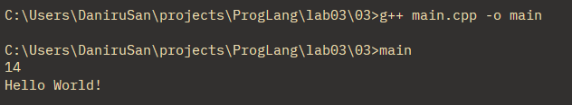\
*Но в Java я получил такую ошибку*\
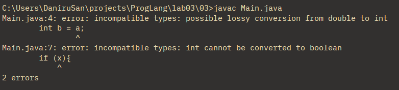

### Задание 4 
*Я рассмотрел данную ниже программу*
```
bool x = true, y = false;
auto a = x & y;
std::cout << typeid(a).name() << std::endl;
auto b = x && y;
std::cout << typeid(b).name() << std::endl;
```
*Я получил такие результаты*\
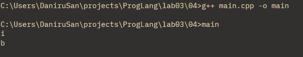\
*В первом случае происходит побитовый И, он приводит обе логических переменных к целочисленному типу.*\
*Во втором случае происходит логическое И, оно приводит обе переменных к логическому типу.* 

### Задание 5. 
***typedef** и **auto***\
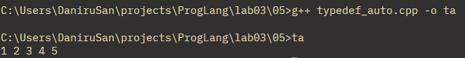\
*В этой программе typedef заменяет вектор целочисленных значений короткой абревиатурой, а с помощью auto в цикле программа выводит все элементы из списка*\

***decltype***\
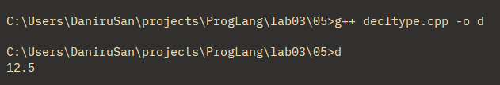\
*В этой программе decltype используется чтобы определить тип переменной z исходя из выражения в скобках, затем идёт присвоение значения этого же выражения.*\

***static_cast***\
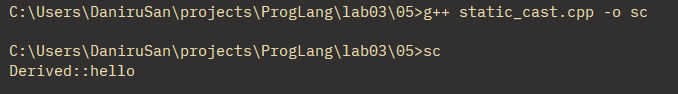\
*В этой программе сперва создаётся базовый указатель на класс, потом с помощью static_cast он явно приводится к Derived, чтобы можно было использовать функции этого класса*\

***sizeof***\
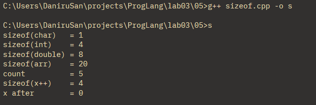\
*В этой программе sizeof показывает размеры разных типов данных*

### Задание 6
*Рассмотрев следующий фрагмент кода*
```
int a = -1, b = 1;
unsigned int c = 1;
std::cout << a*b << std::endl;
std::cout << a*c << std::endl;
```
*Я получил такой ответ*\
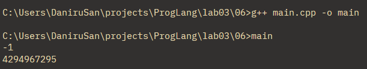

* *В первом выводе не происходит никаких преобразований, так как обе переменных знаковые целочисленные*
* *Во втором выводе знаковая целочисленная переменная приводится к беззнаковой, потому что знаковая не покрывает все возможные элементы беззнаковой. Так как в беззнаковой системе нет -1, то берётся максимальное значение беззнаковой системы и оно и умножается на переменную c*

*После замены unsigned int на short я получил такой вывод*\
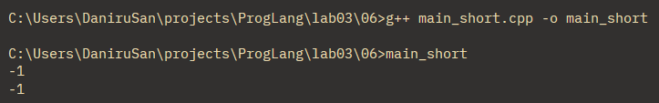

* *Первый вывод не поменялся*
* *Второй вывод поменялся на -1, так как short и unsigned short преобразуются до int. Это происходит из-за того int вмещает все значения short и unsigned short.*

### Задание 7 **(2)**
*Рассмотрите следующий фрагмент программы.*
```
int x = 7, y = 4;
long double d = 0.25;
cout << (x / y) / d << endl;
cout << (x / d) / y << endl;
long a = 200000, b = 200000;
long long c = 200000;
std::cout << (a * b) * c << std::endl;
std::cout << a * (b * c) << std::endl;
```
*Почему изменения порядка действий приводит
к изменению результата? Объясните работу этой программы, используя правила неявного преобразования типов*

### Задание 8 
*После рассмотрения выражения ниже я написал программу, которая находит все значения при которых это выражение даёт истину. Так как здесь всё зависит от логических оппераций, важно не само значение переменных, а их равенство, так что в ответ я запишу значения переменных в пределах от 0 до 1.* 
```
(x == y) + (x == z) == true
```
*В итоге я получил такие результаты*\
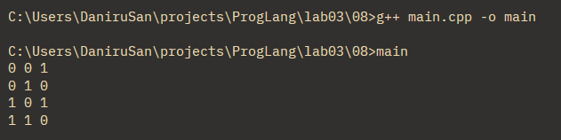

*Так получается из-за того, что сперва из скобок, исходя из равенства переменных, программа получает 1 или 0, дальше складывает их и сравнивает с 1 (true). Значит, что если одна скобка будет верна, а другая не верна, то программа даст истинный результат. Это хорошо видно на скриншоте.*

### Задание 9
*После проверки данного выражения в программах на разных значениях я получил следующие выводы*
```
x = 2
y = 2
z = 2
print(x==y==z)
x += 1
print(x==y==z)
```
*Python*\
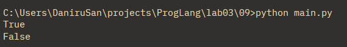\
*Всё сработает как и должно, так как в Python есть тройное сравнение.*

*C++*\
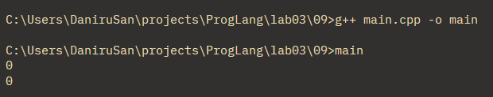\
*В программе сперва сравнивается первые две переменных, они дают 1, это сравнивается с третьей переменной, что даёт 0, так как 1 не равно 2. Во втором выводе тоже самое, только вместо 1 в первом сравнении программа получает 0, так как 3 не равно 2.*

*Java*\
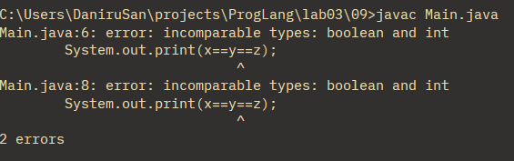\
*Код не откомпилируется, так как после первого сравнения получается сравнение логического и целочисленного типа, что вызвает ошибку.*

### Задание 10 **(1))**

*Напишите программу на* **Python** *, демонстрирующую возможность неявного преобразования
строки в логическое значение.*

*Записанную программу сохраните в папке с номером задания.*
