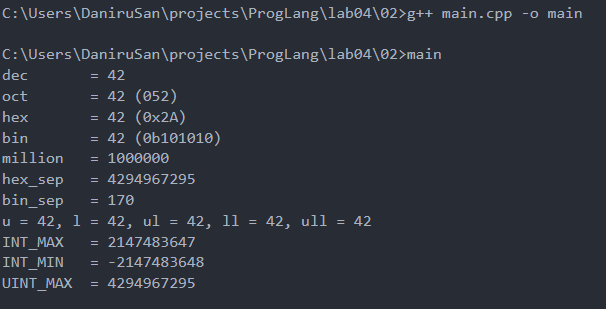
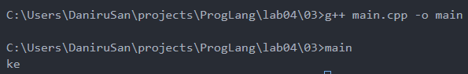
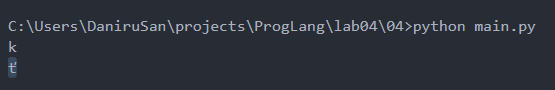
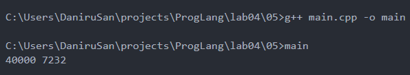
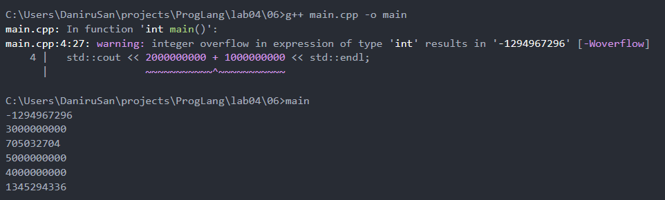
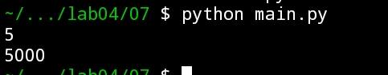
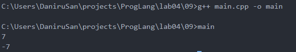

# Языки программирования
## Лабораторная работа 3

### Задание 1
**Двоичное представелние числа -99**
*Двоичное представление числа -99 находиться инверсией двоичного представления числа 99 и прибавлением 1. Это число умещается в 1 байт, поэтому при 2 и 4 байтах будет одно и тоже число, просто больше единиц перед самим числом.*
* *99 = 0110 0011*
* *~99 = 1001 1100*
* *-99 = 1001 1101*
* *1 байт: 1001 1101*
* *2 байта: 1111 1111 1001 1101*
* *4 байта: 1111 1111 1111 1111 1111 1111 1001 1101*
 
**Запишите литералы равные наибольшему и наименьшему числу в типе* **int** *в шестнадцатеричной записи.**
* *Наибольшее 2 147 483 647 = 0x7FFFFFFF*
* *Наименьшее -2 147 483 648 = 0x80000000*
 
**Двоичное представление *#* в *char***
*0010 0011*


### Задание 2 


### Задание 3 
*Запустив программу, я получил такой вывод*\


* *Первый символ такой, потому что код буквы k в системе ascii отличается от a на 10*
* *Второй вывод такой, потому что при добавлении к коду буквы k идёт переполнение и чтобы найти нужный элемент в таблице берётся модуль по 2^8, что даёт код 101, а это код буквы e.*

*В итоге перменная а меняет свой код так*
* 97
* 97 + 10 = 107
* 107 + 250 = 357
* 357 % 256 = 101

### Задание 4
*Я переписал данный код и получил такой вывод*\


*Вывод такой, ведь в отличии от C++, Python использует таблицу Unicode для символов, вместо таблицы ASCII*
* *Первый вывод такой же как в C++ по той же причине*
* *Второй вывод такой, потому что переполнения не происходит и программа выдаёт символ кода 357*

*В итоге перменная а меняет свой код так*
* 97
* 97 + 10 = 107
* 107 + 250 = 357

### Задание 5.
*После запуска кода я получил такой вывод*\


*Сперва разберём переменную y*
* *40 000 + 40 000 = 80 000*
* *y = 80 000 mod 65 536 = 14 464*
* *14 464 - 40 000 = -25 536*
* *y = -25 536 + 65 536 = 40 000*\
*Здесь получилось, что после всех преобразований число вернулось в исходный вид*

*Теперь разберём переменную z*
* *40 000 * 2 = 80 000*
* *z = 80 000 mod 65 536 = 14 464*
* *z = 14 464 / 2 = 7 232*\
*Здесь в конце преобразоваий не призошло и из-за этого число не вернулось в исходный вид* 

### Задание 6
```
std::cout << 2000000000 + 1000000000 << std::endl;
```
*Два числа являются int, происходит знаковое переполнение, поэтому вывод будет -1 294 967 296*
* *2 000 000 000 + 1 000 000 000 = 3 000 000 000*
* *3 000 000 000 - 4 294 967 296 = -1 294 967 296*

```
std::cout << 2000000000U + 1000000000U << std::endl;
```
*Два числа являются unsigned int, здесь места хватает для обычного сложения, так что вывод 3 000 000 000*

```
std::cout << 2500000000U + 2500000000U << std::endl;
```
*Два числа являются unsigned int, происходит беззнаковое переполнение, вывод будет 705 032 704*
* *2 500 000 000 + 2 500 000 000 = 5 000 000 000*
* *5 000 000 000 mod 4 294 967 296 = 705 032 704* 

```
std::cout << 2500000000LL + 2500000000LL << std::endl;
```
*Два числа являются long long int, здесь места хватает, вывод 5 000 000 000*

```
std::cout << 20000U * 200000U << std::endl;
```
*Два числа являются unsigned int, места хватает, вывод 4 000 000 000*

```
std::cout << 200000U * 200000U << std::endl;
```
*Два числа являются unsigned int, происходит беззнаковое переполнение, вывод будет 1 345 294 336*
* *2 000 000 000 * 2 000 000 000 = 40 000 000 000*
* *40 000 000 000 mod 4 294 967 296 = 1 345 294 336*

*В поттверждение своих вычеслений вот вывод программы с этими элементами кода*\


### Задание 7
*Я дописал код ниже используя битовые сдвиги и сложение.*

```
x = int(input())
y = ...
print(y)
```

*Я сдвинул 3 раза сдвинул число на 2 и прибвил его же, благодаря чему оно умножалось на 5. После я сдвинул число на 3, что равносильно умножению на 8. Получилось что число сперва умножилось на 125 (5 в третьей степени), а после на 8, что даёт ровно 1000. В итоге я получил такой результат.*\


### Задание 8
**`(1000 & 100) << 10`**
* *1000 = 0000 0000 0000 0000 0000 0011 1110 1000*
* *100  = 0000 0000 0000 0000 0000 0000 0110 0100*
* *&    = 0000 0000 0000 0000 0000 0000 0110 0000*
* *<<10 = 0000 0000 0000 0001 1000 0000 0000 0000*
* *Ответ 98304*

**`(1000 >> 4) & 15`**
* *1000 = 0000 0000 0000 0000 0000 0011 1110 1000*
* *>>4  = 0000 0000 0000 0000 0000 0000 0011 1110*
* *15   = 0000 0000 0000 0000 0000 0000 0000 1111*
* *&    = 0000 0000 0000 0000 0000 0000 0000 1110*
* *Ответ 14*

**`~1234 + 1234`**
* *1234  = 0000 0000 0000 0000 0000 0100 1101 0010*
* *~1234 = 1111 1111 1111 1111 1111 1011 0010 1101*
* *+     = 1111 1111 1111 1111 1111 1111 1111 1111*
* *Ответ -1*


**`(1000 ^ 500) & 63`**
* *1000 = 0000 0000 0000 0000 0000 0011 1110 1000*
* *500  = 0000 0000 0000 0000 0000 0001 1111 0100*
* *^    = 0000 0000 0000 0000 0000 0010 0001 1100*
* *63   = 0000 0000 0000 0000 0000 0000 0011 1111*
* *&    = 0000 0000 0000 0000 0000 0000 0001 1100*
* *Ответ 28*

**`(100 << 3) + (100 >> 3)`**
* *100  = 0000 0000 0000 0000 0000 0000 0110 0100*
* *<<3  = 0000 0000 0000 0000 0000 0011 0010 0000*
* *100  = 0000 0000 0000 0000 0000 0000 0110 0100*
* *>>3  = 0000 0000 0000 0000 0000 0000 0000 1100*
* *+    = 0000 0000 0000 0000 0000 0011 0010 1100*
* * *Ответ 812*

###  Задание 9
*Я написал программу которая считывает число, затем делает битовое отрицание этого числа и прибавляет к нему 1. Результат вывода на скриншоте ниже.*\

